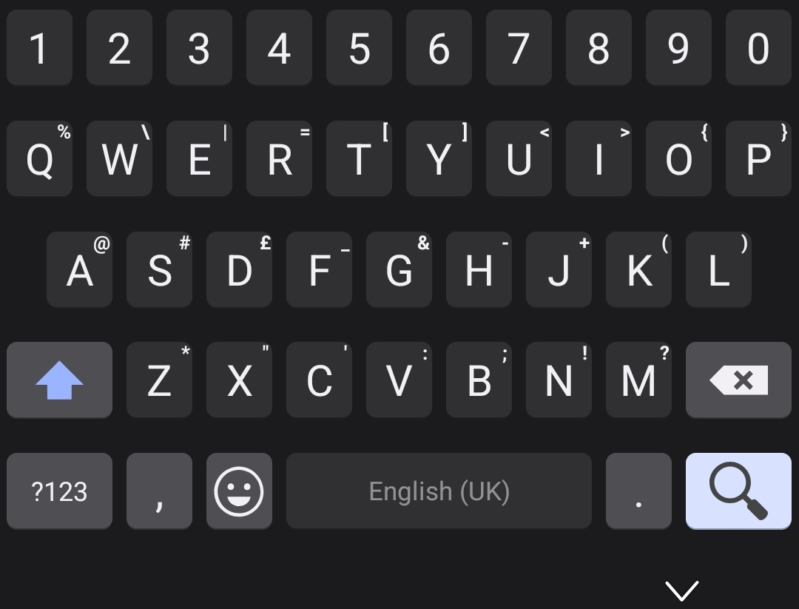

[HeliBoard Github](https://github.com/Helium314/HeliBoard)

This folder contains how I customised HeliBoard

# Why use HeliBoard

It is open source and it doesn't need an internet connection. It runs completly offline, insuring privacy and security. Unlike GBoard

Only major difference is that there is no slide writing on the keyboard. 

This is how it looks: 

